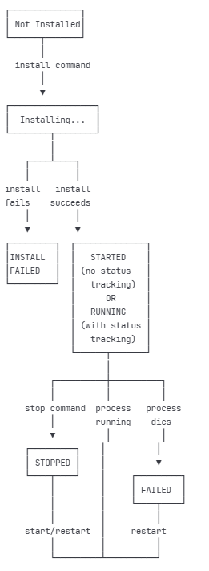
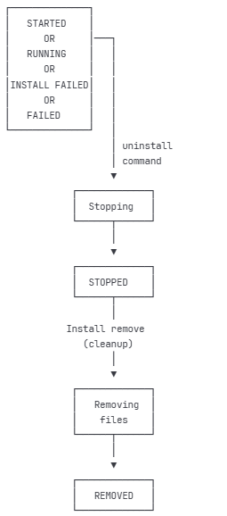

# Appendices

## Appendix A: App-Manager Command Reference

Complete reference for all app-manager commands and options. Syntax is:

```bash
$ app-manager --command <command> [options]
```

**Full Options Reference**

```
app-manager --command <command> [options...]
-c, --command <command>   One of install, config, remove, start, stop, restart, status, init, installdeps, list-installed
-i, --appid <id>          Unique application ID
-v, --appversion <version> Version of the application to install
-t, --apptype <type>      Type of application (currently only CUSTOM)
-f, --appfile <path>      Path to the app tarball when installing from a local file
-m, --appmd5 <checksum>   MD5 checksum for the --appfile
-I, --appstoreip <url>    URL of the app store
    --notify              Send notification on completion
    --activate            Activate after installation
    --noAppBackup         Skip backing up existing version
```

**Commands**

**install** - Install a custom application

```bash
$ app-manager --command install \
      --appid 666d78aa-8270-446f-88cb-04c799558476 \
      --appfile /tmp/custom_app.tar.gz \
      --configids '[ {"id":"file:///tmp/main.cfg"}, {"id":"file:///tmp/secondary.cfg"} ]'
```

Install from MultiTech Device Manager (cloud):

```bash
$ app-manager --command install \
      --appid 300d78aa-8270-446f-88cb-04c799558476 \
      --appversion 1.0 \
      --appmd5 65570c56a98a29b1b483c521e7c57d80 \
      --appstoreip api.multitech.com
```

**remove** - Uninstall a custom application

```bash
$ app-manager --command remove --appid 666d78aa-8270-446f-88cb-04c799558476
```

**start** - Start a stopped application

```bash
$ app-manager --command start --appid 666d78aa-8270-446f-88cb-04c799558476 --notify
```

**stop** - Stop a running application

```bash
$ app-manager --command stop --appid 666d78aa-8270-446f-88cb-04c799558476 --notify
```

**restart** - Restart an application

```bash
$ app-manager --command restart --appid 666d78aa-8270-446f-88cb-04c799558476 --notify
```

**status** - Display status of all applications

```bash
$ app-manager --command status
```

**config** - Install configuration file (R.7.1.0+)

```bash
$ app-manager --command config --appid 666d78aa-8270-446f-88cb-04c799558476 \
    --configids '[ {"id":"file:///tmp/main.cfg"}, {"id":"file:///tmp/secondary.cfg"} ]'
```

**installdeps** - Install dependencies only (R.7.1.0+)

```bash
$ app-manager --command installdeps --appid 666d78aa-8270-446f-88cb-04c799558476
```

**list-installed** - List installed applications (R.7.1.0+)

```bash
$ app-manager --command list-installed
```

**Exit Codes**

-   **0**: Success
-   **1**: General error
-   **2**: Invalid arguments
-   **3**: Application not found
-   **4**: Installation failed
-   **5**: Start/stop failed

## Appendix B: Status Transitions

Visual reference for application status states and transitions. Status states are:

-   **STARTED** - Application has been started but status.json not present or not being monitored
-   **RUNNING** - All monitored processes are running
-   **STOPPED** - Application has been stopped
-   **FAILED** - One or more monitored processes are not running
-   **INSTALL FAILED** - Installation encountered errors
-   **START FAILED** - Application failed to start

**Installation State Transition Diagram**



**Uninstallation State Diagram**



**Status Display Rules**

| **Condition** | **Status** | **Color** |
| --- | --- | --- |
| No status.json present | STARTED | Yellow |
| status.json exists, all PIDs running | RUNNING | Green |
| status.json exists, any PID not running | FAILED | Red |
| Application stopped via stop command | STOPPED | Red |
| Installation failed | INSTALL FAILED | Red |
| Start command failed | START FAILED | Red |


**Multi-Process Status Logic**

```
IF no status.json:
    status = STARTED
ELSE IF status.json has single PID:
    IF process with PID is running:
        status = RUNNING
    ELSE:
        status = FAILED
ELSE IF status.json has PID array:
    IF ALL processes in array are running:
        status = RUNNING
    ELSE IF ANY process in array is not running:
        status = FAILED
```

## Appendix C: Direct Process Management Example

```bash
#!/bin/bash
NAME="MultiProcessApp"
APP_DIR=${APP_DIR:-.}
STATUS_FILE="${APP_DIR}/status.json"

do_start() {
    logger -t "$NAME" "Starting all processes"

    # Start main process in background
    "${APP_DIR}/main_process" --config "${CONFIG_DIR}/main.conf" \
        >> "${APP_DIR}/main.log" 2>&1 &
    MAIN_PID=$!
    echo "$MAIN_PID" > "${APP_DIR}/main.pid"

    # Start worker processes
    for i in 1 2 3; do
        "${APP_DIR}/worker_process" --id "$i" --config "${CONFIG_DIR}/worker.conf" \
            >> "${APP_DIR}/worker_${i}.log" 2>&1 &
        WORKER_PID=$!
        echo "$WORKER_PID" > "${APP_DIR}/worker_${i}.pid"
    done

    # Give processes time to initialize
    sleep 2

    if ! check_processes_running; then
        logger -t "$NAME" "ERROR: One or more processes failed to start"
        do_stop
        return 1
    fi

    update_status
}

do_stop() {
    # Stop workers first
    for i in 1 2 3; do
        if [ -f "${APP_DIR}/worker_${i}.pid" ]; then
            WORKER_PID=$(cat "${APP_DIR}/worker_${i}.pid")
            if kill -0 "$WORKER_PID" 2>/dev/null; then
                kill -TERM "$WORKER_PID" 2>/dev/null
                for retry in {1..30}; do
                    if ! kill -0 "$WORKER_PID" 2>/dev/null; then break; fi
                    sleep 1
                done
                kill -9 "$WORKER_PID" 2>/dev/null
            fi
        fi
    done

    # Stop main process last
    if [ -f "${APP_DIR}/main.pid" ]; then
        MAIN_PID=$(cat "${APP_DIR}/main.pid")
        if kill -0 "$MAIN_PID" 2>/dev/null; then
            kill -TERM "$MAIN_PID" 2>/dev/null
            for retry in {1..30}; do
                if ! kill -0 "$MAIN_PID" 2>/dev/null; then break; fi
                sleep 1
            done
            kill -9 "$MAIN_PID" 2>/dev/null
        fi
    fi
}

check_processes_running() {
    if [ -f "${APP_DIR}/main.pid" ]; then
        MAIN_PID=$(cat "${APP_DIR}/main.pid")
        if ! kill -0 "$MAIN_PID" 2>/dev/null; then return 1; fi
    else
        return 1
    fi

    for i in 1 2 3; do
        if [ -f "${APP_DIR}/worker_${i}.pid" ]; then
            WORKER_PID=$(cat "${APP_DIR}/worker_${i}.pid")
            if ! kill -0 "$WORKER_PID" 2>/dev/null; then return 1; fi
        fi
    done
    return 0
}

update_status() {
    local pids="["
    local first=true

    if [ -f "${APP_DIR}/main.pid" ]; then
        MAIN_PID=$(cat "${APP_DIR}/main.pid")
        pids="${pids}{"name":"main","pid":${MAIN_PID}}"
        first=false
    fi

    for i in 1 2 3; do
        if [ -f "${APP_DIR}/worker_${i}.pid" ]; then
            WORKER_PID=$(cat "${APP_DIR}/worker_${i}.pid")
            [ "$first" = false ] && pids="${pids},"
            pids="${pids}{"name":"worker_${i}","pid":${WORKER_PID}}"
            first=false
        fi
    done
    pids="${pids}]"

    echo "{"pid": $pids, "AppInfo": "All processes running"}" > "$STATUS_FILE"
}

case "$1" in
    start)   do_start ;;
    stop)    do_stop ;;
    restart) do_stop; sleep 2; do_start ;;
    *)       echo "Usage: $0 {start|stop|restart}"; exit 1 ;;
esac
```

## Appendix D: Environment Variables Reference

Complete reference for environment variables available to Install and Start scripts.

**Variables Set by App-Manager (R.7.1.0+)**

| **Variable** | **Description** | **Example Value** | **Available In** |
| --- | --- | --- | --- |
| APP_DIR | Full path to application installation directory | /var/config/MyApp | Start |
| CONFIG_DIR | Full path to configuration directory | /var/config/app/MyApp/config | Start |
| APP_ID | Application name from MT Device Manager | 611d1dde31eddd056018b8bf | Start |


**Usage Examples**

**In Start script**

```bash
#!/bin/bash
# Use environment variables for portability
APP_ID="$APP_ID"
DAEMON="$APP_DIR/myapp.py"
DAEMON_ARGS="--config $CONFIG_DIR/app.conf"
PIDFILE="$APP_DIR/myapp.pid"
STATUS_FILE="$APP_DIR/status.json"

start-stop-daemon --start \
    --pidfile "$PIDFILE" \
    --exec "$DAEMON" \
    -- $DAEMON_ARGS
```

**Providing Default Values**

Always provide defaults for robustness:

```bash
#!/bin/bash
APP_DIR=${APP_DIR:-.}
CONFIG_DIR=${CONFIG_DIR:-$APP_DIR/config}
APP_ID=${APP_ID:-611d1dde31eddd056018b8bf}

echo "Running $APP_ID from $APP_DIR"
```

**Passing to Your Application**

Export variables for your application to use:

```bash
#!/bin/bash
do_start() {
    export MY_APP_DIR="$APP_DIR"
    export MY_CONFIG_DIR="$CONFIG_DIR"
    export MY_APP_ID="$APP_ID"

    start-stop-daemon --start --exec "$DAEMON"
}
```

**Python Access**

```python
import os

app_dir = os.environ.get('MY_APP_DIR')
config_dir = os.environ.get('MY_CONFIG_DIR')
app_id = os.environ.get('MY_APP_ID')

print(f"Running {app_id} from {app_dir}")
```

**Additional System Variables**

These standard Linux variables are also available:

| **Variable** | **Description** |
| --- | --- |
| PATH | System executable search path |
| HOME | User home directory |
| USER | Current user (usually root) |
| PWD | Current working directory |
| SHELL | Current shell |


**Best Practices**

-   **Always use APP_DIR** for application files
-   **Use CONFIG_DIR** for configuration files
-   **Provide defaults** for all variables
-   **Export if needed** by your application
-   **Document** expected variables in your code
-   **Test manually** by setting variables and running scripts
